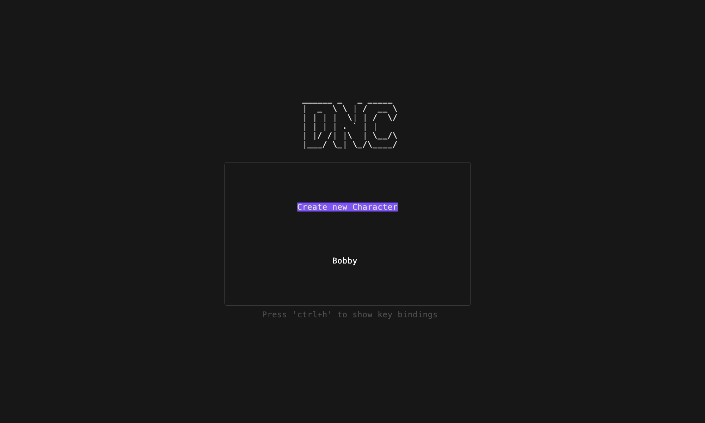

```
______ _   _ _____
|  _  \ \ | /  __ \
| | | |  \| | /  \/
| | | | . ` | |
| |/ /| |\  | \__/\
|___/ \_| \_/\____/
```

[](https://github.com/Simon-Hostettler/dnc/actions/workflows/go.yml)


A terminal-based TTRPG character manager built with Bubble Tea, Lip Gloss and DuckDB. It provides a TUI to create and edit various character data (stats, spells, items, etc.).



## Quick start

Requirements

- Go (recommended 1.25+)
- A terminal that supports alternate screen and UTF-8

Install and build the binary:

```bash
go install hostettler.dev/dnc@latest
```

If you can't run the bin, add the output of the following command to your `$PATH`:

```bash
go env GOBIN GOPATH
```

You can modify the key bindings stored at `os.UserConfigDir()/dnc/config.json`. Defaults can be found in `util.DefaultKeyMap()` or by pressing `ctrl+h`.

## Quick actions

Press `:` to open the quick action palette. Use `tab` to autocomplete from suggestions.

Available actions:

| Action                  | Description                                              |
| ----------------------- | -------------------------------------------------------- |
| `longrest`              | Resets HP, death saves, and spell slots                  |
| `cast <1-9>`            | Uses a spell slot at the given level                     |
| `heal <amount>`         | Restores hit points (capped at max)                      |
| `dmg <amount>`          | Reduces hit points (floored at 0)                        |
| `prob <expr cmp value>` | Probability that a dice expression satisfies a condition |
| `ev <expression>`       | Expected value of a dice expression                      |
| `dist <expression>`     | Distribution stats for a dice expression                 |

Dice expression syntax supports standard dice notation: `2d6`, `4d6kh3` (keep highest 3), `1d20 + 5`, etc. Examples:

```
prob 1d20 + 5 >= 15    → P = 0.5500
ev 4d6kh3              → E = 12.2446
dist 2d6               → mean: 7.00  std: 2.42
                          min:  2      max: 12
                          mode: 7      med: 7
```

Expressions can include probability gates: `P[expr cmp value]` evaluates to 1 if the condition holds and 0 otherwise, so multiplying by it models conditional damage. For example, `dist P[1d20 > 15] * 8d6` gives the distribution of damage dealt by an attack that hits on a roll above 15.

## Code layout

This repository is organized as a single Go module (`hostettler.dev/dnc`) with the following rough layout:

```
├── LICENSE
├── README.md              // <-- You are here
├── architecture_test.go   // enforces arch layout + interface implementation
├── command                // generic cross-package tea commands
├── db                     // Driver for DuckDB, migration logic + migrations
├── demo.tape              // vhs tape to produce demo gif
├── dncapp.go              // Main command handler & coordinator, top-level bubble tea program
├── go.mod
├── go.sum
├── main.go                // Application bootstrap
├── models                 // Types reflecting stored data objects & helper types
├── repository             // Interfaces + implementations for data repositories
├── ui                     // Screens, editors, other tea models
└── util                   // Configs & small utilities
```

To avoid convoluted dependencies, `command`, `util`, `models` and `db` are not allowed to have internal dependencies. `repository` can only depend on `models`, `db` and `util`. Only `dncapp.go` and packages in `ui` are allowed to import the others. Packages in `ui` should avoid depending on each other, except for `screen`, which brings them together.

## Data

Data is currently stored in a local DuckDB database using sqlx.

To create a backup of the database run:

```
dnc --backup <output_filename>
```

To restore a backup run:

```
dnc --restore <backup_filename>
```

Be aware that this irreversibly overwrites the current database! Use with caution.

- Location (default): Given by `os.UserConfigDir()` (`~/Library/Application Support/dnc/dnc.db` on macOS)
- Migrations: custom parser, migration files under `db/migrations`.

To add a migration:

1. Create a new file in `db/migrations` named like `0002_add_foo.sql`.
2. Include sections:

```
   -- +duckUp
   -- SQL to apply
   -- +duckDown
   -- SQL to roll back
```

Migrations will be applied automatically at startup

## Testing

Unit tests plus view regression tests. Each UI component should register a rendered file to compare against to prevent unwanted layout changes (See `util/golden.go` and `ui/screen/view_regression_test.go` for an example). To update golden files after intentional view changes or to create one initially:

```bash
go test ./... -update
```

## License

This software is distributed under the [GNU GPL v3](./LICENSE).

This software makes use of certain game mechanics and terminology that also appear in the System Reference Document (SRD) published by Wizards of the Coast, such as concepts including “ability scores,” “proficiency bonus,” and similar rule terms. These elements are functional game mechanics and generic terminology, which are [not subject to copyright protection](https://web.archive.org/web/20160411131325/http://www.copyright.gov/fls/fl108.html).

This software does not reproduce, distribute, or include any text, tables, or other expressive content from the SRD or any other copyrighted work. Accordingly, this software is not a derivative work of the SRD and is not distributed under the Open Gaming License (OGL).

## Contributing

Feature requests (through issues) or PRs are very welcome :) Please make sure your contribution is compatible with the above-described licensing.
