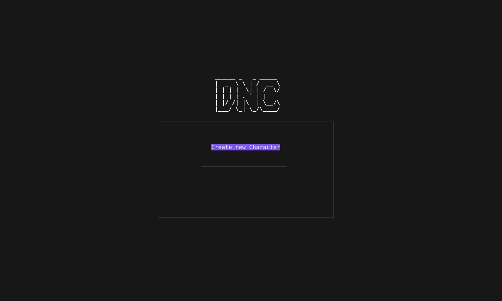

```
______ _   _ _____
|  _  \ \ | /  __ \
| | | |  \| | /  \/
| | | | . ` | |
| |/ /| |\  | \__/\
|___/ \_| \_/\____/
```

[](https://github.com/Simon-Hostettler/dnc/actions/workflows/go.yml)

A terminal-based TTRPG character manager built with Bubble Tea, Lip Gloss and DuckDB. It provides a TUI to create and edit various character data (stats, spells, items, etc.).



## Code layout

This repository is organized as a single Go module (`hostettler.dev/dnc`) with the following rough layout:

```
├── LICENSE
├── README.md     // <-- You are here
├── command       // generic cross-package tea commands
├── db            // Driver for DuckDB, migration logic + migrations
├── demo.tape     // vhs tape to produce demo gif
├── dncapp.go     // Main command handler & coordinator, top-level bubble tea program
├── go.mod
├── go.sum
├── main.go       // Application bootstrap
├── models        // Types reflecting stored data objects & helper types
├── repository    // Interfaces + implementations for data repositories
├── ui            // Screens, editors, other tea models
└── util          // Configs & small utilities
```

To avoid convoluted dependencies, `command`, `util` and `db` are not allowed to have internal dependencies. `repository` can only depend on `models`, `db` and `util`. Only `dncapp.go` and packages in `ui` are allowed to import the others. Packages in `ui` should avoid depending on each other, except for `screen`, which brings them together.

## Quick start

Requirements

- Go (recommended 1.25+)
- A terminal that supports alternate screen and UTF-8

Run from the project root:

```bash
# run directly
go run .

# or build and execute
go build -o dnc .
./dnc
```

You can modify the keymap stored at `os.UserConfigDir()/dnc/config.json`. Defaults can be found in `util.DefaultKeyMap()`, but `ctrl+c` should get you out :)

## Data

Data is currently stored in a local DuckDB database using sqlx.

- Location (default): Given by `os.UserConfigDir()` (`~/Library/Application Support/dnc/dnc.db` on macOS)
- Migrations: custom parser, migration files under `db/migrations`.

To add a migration:

1. Create a new file in `db/migrations` named like `0002_add_foo.sql`.
2. Include sections:

```
   -- +duckUp
   -- SQL to apply
   -- +duckDown
   -- SQL to roll back
```

Migrations will be applied automatically at startup

## Testing

Currently mostly smaller unit tests. Looking to implement larger integration tests using `teatest`.

## License

This software is distributed under the [GNU GPL v3](./LICENSE).

This software makes use of certain game mechanics and terminology that also appear in the System Reference Document (SRD) published by Wizards of the Coast, such as concepts including “ability scores,” “proficiency bonus,” and similar rule terms. These elements are functional game mechanics and generic terminology, which are [not subject to copyright protection](https://web.archive.org/web/20160411131325/http://www.copyright.gov/fls/fl108.html).

This software does not reproduce, distribute, or include any text, tables, or other expressive content from the SRD or any other copyrighted work. Accordingly, this software is not a derivative work of the SRD and is not distributed under the Open Gaming License (OGL).

## Contributing

Feature requests (through issues) or PRs are very welcome :) Please make sure your contribution is compatible with the above-described licensing.
